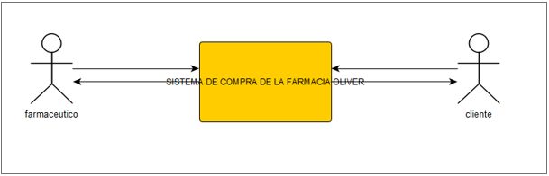
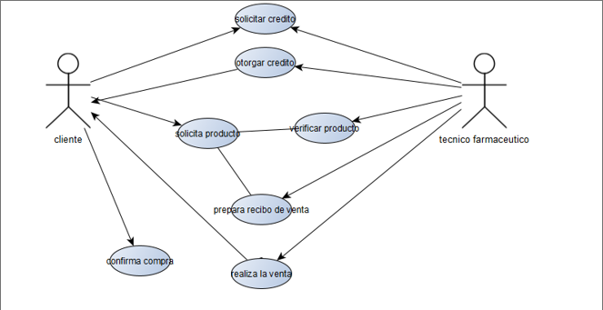
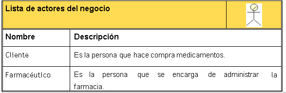
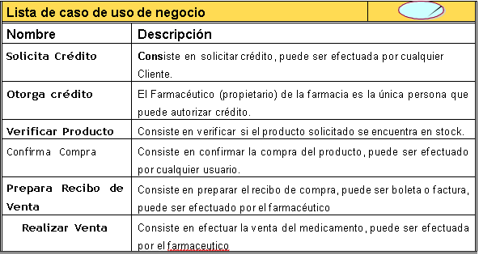
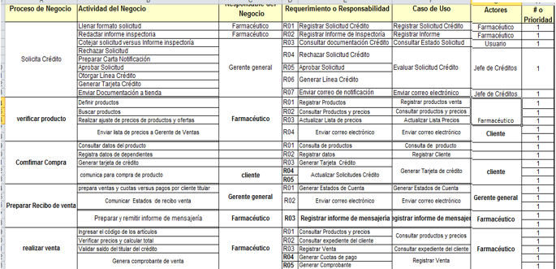

# UNIVERSIDAD CESAR VALLEJO FACULTAD DE INGENIERIA Escuela de Ingeniería de Sistemas

# SISTEMA DE COMPRAS DE LA FARMACIA “OLIVER” FARMACIA “OLIVER”

## Docente BERROCAL NAVARRO, RICHARD LEONARDO ORCID: 0000-0001-8718-3150
## Equipo
 * Flores Capcha, Jeampier Angel
 * Miranda Rosadio, Jose Luis
 * Reategui González, Romel
 * Zevallos chiclla jhonatan
 * Briggitte Jazmine Becerra Plascencia

 ## 1.1 Resumen Ejecutivo
 En este proyecto de sistema de compras en la botica “El Conquistador” veremos cómo sacar su modelo de caso de uso de negocio (MCUN) identificado a los actores y los casos de uso de negocio, identificar y capturar los requerimientos del sistema de compras.

  ## 1.2 Introduccion
En los últimos años, se ha incrementado la tecnología aceleradamente, alcanzando un nivel muy alto a favor de la sociedad. La irrupción de las tecnologías de la información en la vida cotidiana de los ciudadanos es, sin duda, la nota más distintiva de este cruce de milenios. Esta empresa tiene problemas como Constante cambio de personal, Incremento de la delincuencia en el distrito de San Martin de Porres. También queremos llegar a Analizar el desarrollo de las transacciones realizadas en la botica “El conquistador”. Identificar los programas y las diferentes interacciones que esta realiza en el sistema de venta de la empresa. Identificar los diferentes tipos de sistemas que se usa en la empresa. Analizar cómo influye la realidad nacional en el desarrollo del sistema de la botica. Implementar u modificar, según nuestros conocimientos adquiridos, alguna actividad que realiza la empresa

  ## 1.3 Estudio de Factibilidad
El presente estudio de factibilidad para analizar los efectos de los sistemas de información transaccional de la farmacia, “El conquistador”, está estructurado en tres capítulos. A continuación, se presenta de una manera breve el desarrollo del presente trabajo:
En el primer capítulo referente al marco teórico; se detallan una serie de aspectos tales como: el estudio de factibilidad, ya sea operativa y técnica.
En el segundo capítulo se desarrollará un modelo de negocio; donde se realizara un modelo de caso de uso del negocio, modelo de análisis del negocio, glosario de términos y reglas de negocio.
En el tercer capítulo se hará una captura de requerimientos; como una fuente de obtención de requerimiento y un modelo de caso de uso de la empresa.

## 1.3.1 Factibilidad operativa y técnica: La visión del sistema
**Factibilidad operativa**
Al momento de ser concluido el proceso de elaboración del sistema de control de inventario, el mismo será implantado para luego ser utilizado en el control de entradas y salidas de mercancía de la farmacia “El conquistador”.
**Factibilidad Técnica**
La farmacia “El conquistador” actualmente cuenta con la disponibilidad de los equipos necesarios que permiten la elaboración e implementación de un nuevo sistema.
El personal que trabajara con el sistema propuesto posee la experiencia técnica requerida para operar, implementar y mantener el dicho sistema, es decir, el personal está apto para manejar por sí mismo.
El software que será implementado cumple con los requerimientos para la elaboración del sistema propuesto.

## 2. Modelo De Negocio

## 2.1 Modelo de Caso de Uso del Negocio

#### 2.1.1. Lista de los Actores del Negocio

#### 2.1.2. Lista de Casos de Uso del Negocio

#### 2.1.3. Diagrama de Casos de Uso del Negocio

|        |   |
|-------------|-------------|
|Caso de USoo   |Solicitar Crédito.|
|Actores        |Cliente, Farmacéutico.|
|Descripción    |El usuario solicita crédito para la compra a realizar.|

|        |   |
|-------------|-------------|
|Caso de USoo   |Otorga Crédito|
|Actores        |Farmaceutico, Cliente|
|Descripción    |El Farmaceutico verifica situación de crédito, si  tiene crédito vigente autoriza el mismo. El farmaceutico es el único que puede otorgar el crédito.|

|        |   |
|-------------|-------------|
|Caso de USoo   |Solicita Producto.|
|Actores        |Cliente, Farmacéutico.|
|Descripción    |El Cliente solicita uno o muchos medicamentos.|

|        |   |
|-------------|-------------|
|Caso de USoo   |Verifica Producto.|
|Actores        |Farmacéutico|
|Descripción    |El Farmacéutico verifica si el medicamento solicitado se encuentra en stock.|

|        |   |
|-------------|-------------|
|Caso de USoo   |Confirmar compra.|
|Actores        |Cliente.|
|Descripción    |El	cliente una vez evaluado el precio y la calidad del medicamento solicitado confirma la adquisición.|

|        |   |
|-------------|-------------|
|Caso de USoo   |Preparar recibo de venta.|
|Actores        |Farmacéutico.|
|Descripción    |El Farmacéutico en farmacia, realiza el llenado de la boleta o factura de la compra.|

|        |   |
|-------------|-------------|
|Caso de USoo   |Realizar Venta|
|Actores        |Farmacéutico, Cliente.|
|Descripción    |El	Farmacéutico	realiza	la	venta	del	medicamento solicitado, realizando la entrega del mismo al cliente.|

#### 2.1.4. Especificaciones de Casos de uso del Negocio
##### ECU Gestion de Pedido
###### Especificaiones de Alto Nivel

|Nombre        |   Gestión de Pedido|
|-------------|-------------|
|Descripción|El cliente solicita medicamento. El Farmacéutico verifica la disponibilidad y el crédito del cliente , si cumple los requisitos se procede a hacer la venta.|
|Actores de negocio|Cliente , Farmacéutico|
|Entradas|El cliente solicita un producto mediante crédito o efectivo|
|Entregables|Los datos del clientes son verificados para probar el crédito , ver el stock de medicamentos disponibles|
|Mejoras |Se realiza un recibo de compra puede ser boleta o factura.|

|Nombre        |   Recibe información de stock|
|-------------|-------------|
|Descripción|Este caso de uso empieza cuando el cliente desea realizar alguna compra, y termina cuando el vendedor le brinda la información de poder de adquisición|
|Actores de negocio|Cliente|
|Entradas|Se le brinda la información solicitada.|
|Entregables|Recibe la información requerida, y decide adquirir o no el producto|
|Mejoras |El proceso de brindado de información es usado mediante el programa de almacenamiento y venta, lolfar, el cual analiza el stock y la modifica de acuerdo al proceso.|

|Nombre        |  Realiza pago|
|-------------|-------------|
|Descripción|Este caso de uso empieza cuando el cliente desea adquirir el producto para ello cancela el producto, y termina cuando le dan su vuelto, o no, y su comprobante de pago|
|Actores de negocio|cliente|
|Entradas|Recibe la transacción de compra en efectivo u tarjeta|
|Entregables|Recibe el comprobante de pago|
|Mejoras |El proceso brindado es mediante una boleta o factura manual, la cual se podría implementar una impresora al programa usado para que la entrega del comprobante se mas rápida y eficiente.|

### 2.2. Modelo de Análisis del Negocio
#### 2.2.1. Lista de Trabajadores de Negocio

|Nombre                     |Descripcion                                                                            |
|---------------------------|---------------------------------------------------------------------------------------|
|Vendedor                   |Encargado de brindar información al cliente y realizar el proceso de pago de algún producto adquirido|
|Gerente general            |Encargado e supervisar el ambiente laboral y administrar los recursos de la empresa.|

#### 2.2.2. Lista de Entidades de Negocio

**Origen:** I=Interna, generada por el propio negocio, E=Externa, generada externamente y usada por el negocio como dato o medio de comunicación; **Tipo:** P=Persistente, que almacena datos, F=Formulario o documento impreso

|Nombre    |Descripcion                                                            |Origuen|Tipo|
|----------|-----------------------------------------------------------------------|-------|----|
|Boleta    |Comprobante de pago                                                                     |E      |F   |
|Base de datos   |Lugar de almacenamiento de toda la data de la empresa                              |I      |P   |
|Tarjeta de credito|Medio de pago |E      |P   |
|producto   |Bien tangible, puesto a la venta por la empresa|E      |F   |

## 3. CAPTURA DE REQUERIMIENTOS

### 3.1 Fuentes de obtención de requerimientos
La fuente obtención fueron del Farmacéuticos, Gerente general fueron las personas que fueron entrevistadas para entender cómo funcionaba cada proceso y la labor que realizaba cada uno por separado.

### 3.2 Informe de entrevistas o material técnico
**REQUERIMIENTOS FUNCIONALES**
* Debe permitirme generar planilla para los diferentes tipos de trabajadores.
* Debe mostrar un balance general de las ventas realizadas.
* Debe mostrar mediante estadísticas la ganancia semanal, mensual y anula de la empresa 
* Debe tener diferentes tipos de usuarios.
* Debe tener sistema de seguridad en contraseñas para el acceso.
* Debe generar reportes útiles.
* Debe tener modos de validación de datos

**REQUERIMIENTOS NO FUNCIONALES**
* rendimiento
* disponibilidad
* seguridad
* accesibilidad
* usabilidad
* estabilidad
* portabilidad
* costo
* operatividad

**INTERFACES**
* Hardware: El sistema se debe implementar sobre las compras de productos.
* Software: La aplicación deberá funcionar sobre SQL server.

### 3.3	Matriz de Actividades y Requerimientos

